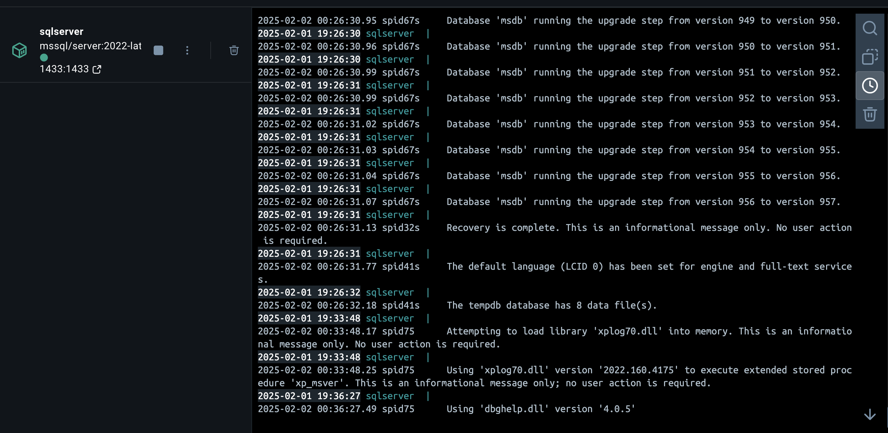
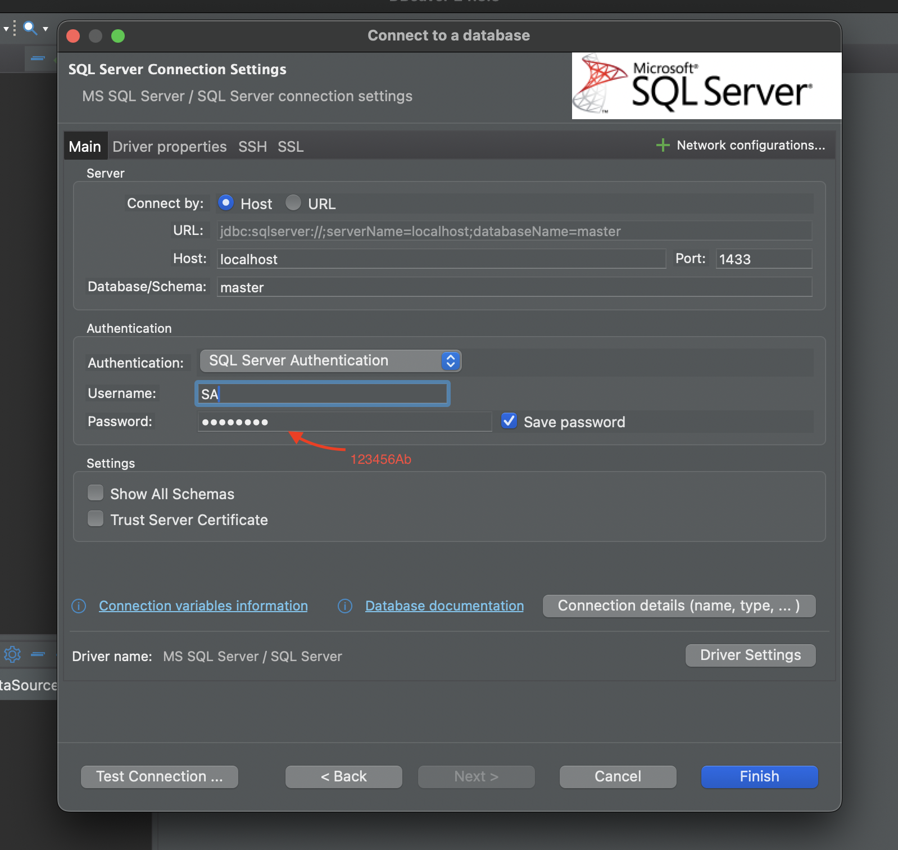
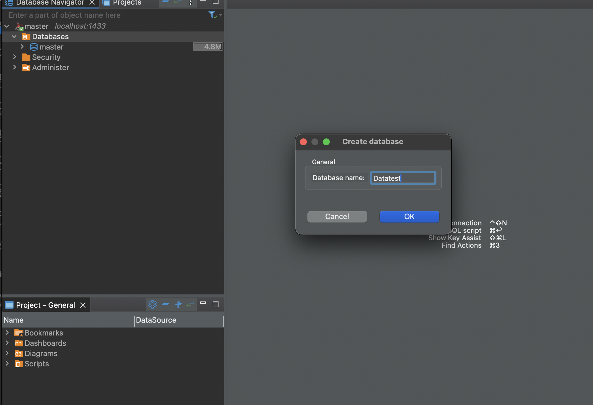
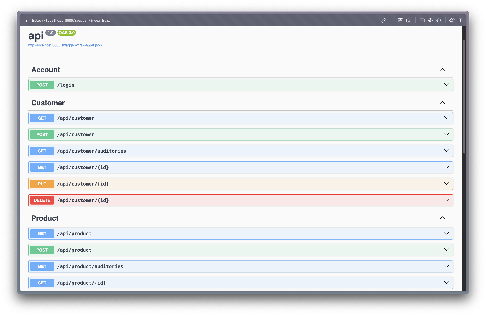
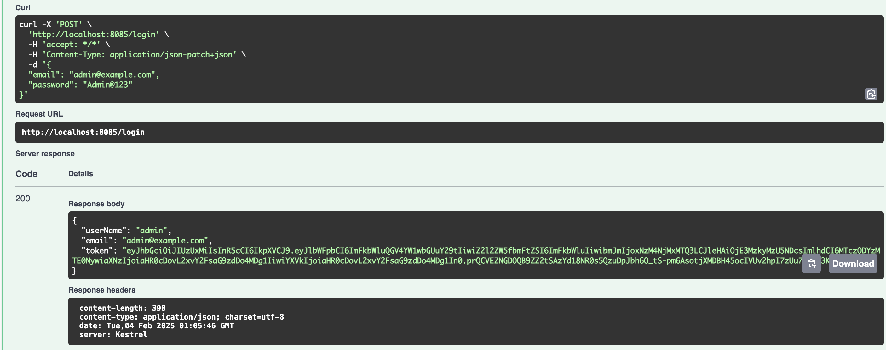
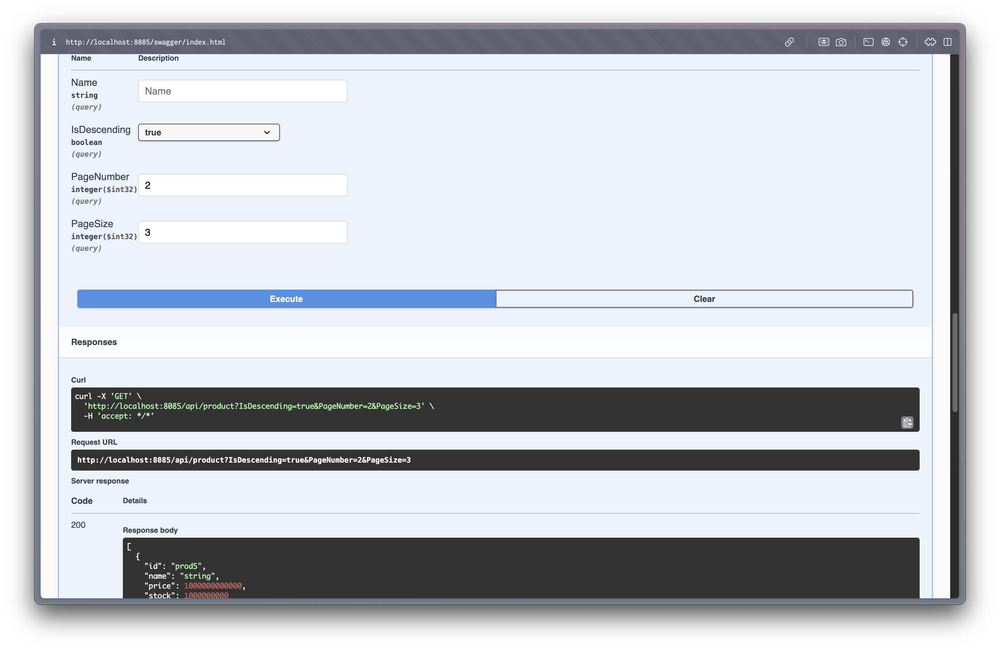
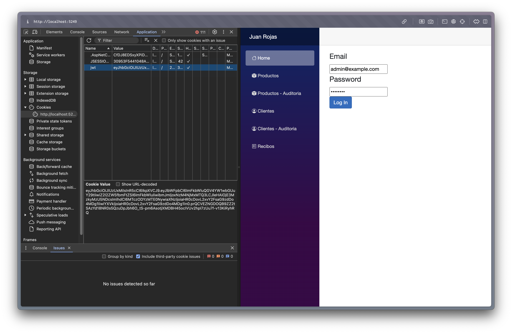
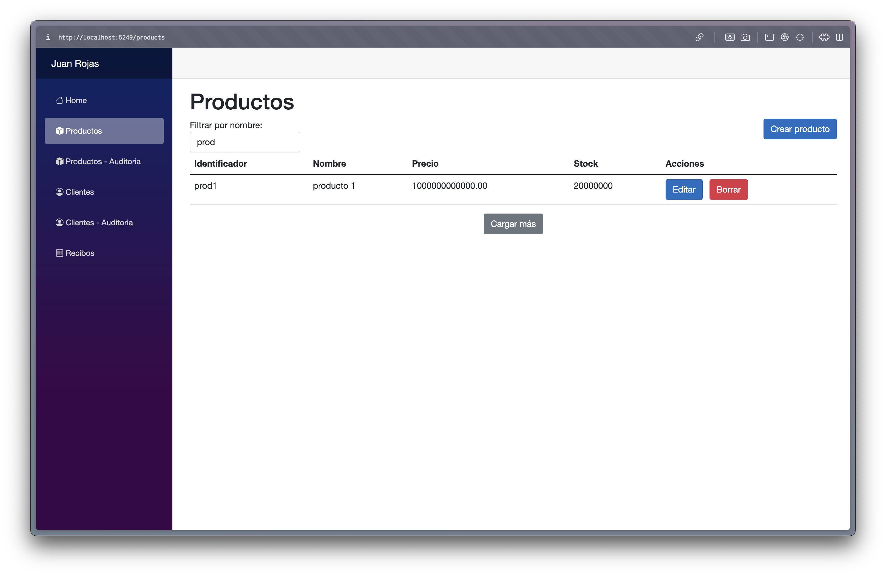

# Prueba técnica para aspirante a desarrolladores junior y soporte de segundo nivel

# Indice

1. [Documento Prueba Tecnica](#documento-prueba-tecnica)
2. [Tech stack](#tech-stack)
3. [Como ejecutar el proyecto](#como-arrancar-el-proyecto)
4. [Comandos utiles](#comandos-utiles)
5. [Capturas De Pantalla](#screenshots)
6. [Licencia](#licencia)

## Documento Prueba Tecnica


## Tech stack

- .net core
- Blazor
- Tailwindcss
- sqlserver 2022

## Como arrancar el proyecto?

1. Descarga [.net core 8](https://dotnet.microsoft.com/en-us/download/dotnet/8.0).
2. Descarga [Docker] (https://www.docker.com/)
3. Inicia la base de datos con `docker compose up -d`
   
4. Conectate a la base de datos
   
5. Crea una base de datos llamada "Datatest"
   
6. Ingresa a la carpeta de api
   `cd api`
7. Ejecuta las migraciones
   `dotnet ef database update`
8. Finalmente, arranca el proyecto del api
   `dotnet watch run`
9. Ahora vuelve a la raiz, ingresa a la carpeta de ui
   `cd .. && cd ui`
10. Ahora arranca el proyecto de ui
    `dotnet watch run`

# Comandos utiles

1. Crear migraciones

`dotnet ef migrations add mi_migracion`

2. Ejecutar migracions

`dotnet ef database update`

3. Conseguir el cliente que mas ha gastado (SQL Server Query)

```sql
   SELECT TOP 1 c.CustomerId, c.Name, SUM(rd.Quantity * p.Price) AS TotalSpent
   FROM ReceiptDetails rd
   JOIN Products p ON rd.ProductId = p.ProductId
   JOIN Receipts r ON rd.ReceiptId = r.ReceiptId
   JOIN Customers c ON r.CustomerId = c.CustomerId
   GROUP BY c.CustomerId, c.Name
   ORDER BY TotalSpent DESC;
```

## Screenshots

###### Swagger UI



###### Backend JWT Endpoint test



###### Listado de todos los productos con paginacion y query desde el Backend



###### Jwt Cookie Frontend Login



###### Pagina de Productos



# Licencia

Este codigo ha sido proporcionado a ConnexusIT S.A.S con el unico proposito de ser usado para el proceso de entrevista para Desarrollador Fullstack. Ningun otro uso, incluido derechos de autor, modificacion, distribucion o la creacion de productos derivados es permitido sin la autorizacion escrita por parte de Juan Diego Rojas Aguilar. Todos los derechos reservados.
